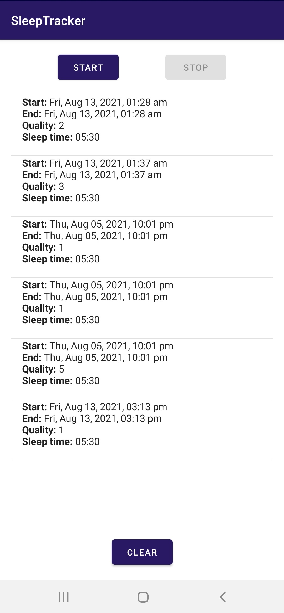
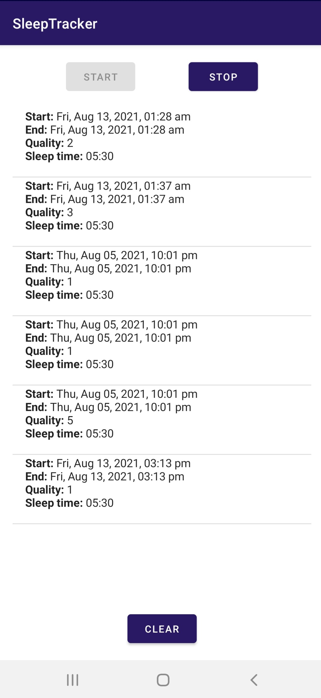
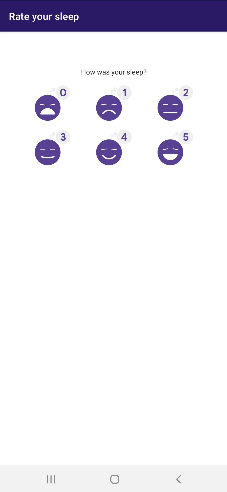

# SleepTracker
An Android application for tracking your sleep, created using android architecture components and integrates APIs hosted on AWS.An

This is a demonstration app created while HSBC Learning Week 2021.

## Screenshots

## Starter guide

This repository have branches created to mark start and end state of each day's progress. If you are starting on nth day of learning week, checkout dayN_begin branch.

Steps:
1. Clone this repo: [SleepTracker](https://github.com/KaANO-8/SleepTracker)
2. Checkout relevant branch as per the day of learning week(for e.g. if you are joining from Day1 checkout day1_*_begin).   
3. Open project in android studio and let the gradle sync dependencies.

## Contributors
- Aayushi Mathur (@aayum)
- Kushagra Jaiswal (@kj280994)
- Rahul Kanojia (@KaANO-8)

